# MELAGE — User Guide

**Version 2.1.1** · *Machine learning & analysis for next-generation neuroimaging and medical imaging research*

MELAGE is an open-source medical imaging platform for analysis, segmentation, and visualisation of multimodal datasets. It combines classical image processing with state-of-the-art deep learning, supporting both an interactive desktop interface and a headless command-line mode.

> **Contact / License:** mealge@inibica.es · jafrasteh.bahram@inibica.es
>
> **Citation:** Jafrasteh, B., Lubián-López, S.P., & Benavente-Fernández, I. (2023). *MELAGE: A purely python based Neuroimaging software (Neonatal).* arXiv preprint.

---

## Table of Contents

1. [Installation and Launch](#1-installation-and-launch)
2. [Supported File Formats](#2-supported-file-formats)
3. [Main Window Layout](#3-main-window-layout)
4. [Projects — New, Save, Load](#4-projects--new-save-load)
5. [Loading Images](#5-loading-images)
6. [Toolbars](#6-toolbars)
7. [Viewing and Navigating Images](#7-viewing-and-navigating-images)
8. [Annotation and Segmentation Drawing](#8-annotation-and-segmentation-drawing)
9. [Dock Widgets](#9-dock-widgets)
10. [Tabs](#10-tabs)
11. [3D Visualisation](#11-3d-visualisation)
12. [Tools Menu](#12-tools-menu)
13. [Plugins](#13-plugins)
14. [Exporting Results](#14-exporting-results)
15. [Settings](#15-settings)
16. [Headless (Command-Line) Mode](#16-headless-command-line-mode)
17. [Mouse and Interaction Reference](#17-mouse-and-interaction-reference)

---

## 1. Installation and Launch

### Create a Virtual Environment (Recommended)

**Linux / macOS:**
```bash
python3 -m venv melage_env
source melage_env/bin/activate
```
**Windows (PowerShell):**
```powershell
python -m venv melage_env
melage_env\Scripts\activate
```

### Install

```bash
pip install melage
```

**With deep learning support (PyTorch):**
```bash
pip install melage[dl]
```

### Launch GUI

```bash
melage
# or from source:
python -m melage.main
```

### Launch Headless (CLI)

```bash
melage --headless --tool <tool_id> --input <file> --output <file>
```

See [Section 16](#16-headless-command-line-mode) for details.

---

## 2. Supported File Formats

| Format | Extensions |
|--------|-----------|
| NIfTI | `.nii` `.nii.gz` `.img` `.hdr` |
| NRRD | `.nrrd` `.nhdr` |
| DICOM | `.dcm` `DICOMDIR` |
| GE Kretz Ultrasound | `.vol` |
| Video / Image | `.mp4` `.avi` `.mov` `.mkv` `.png` `.jpg` `.jpeg` |

---

## 3. Main Window Layout

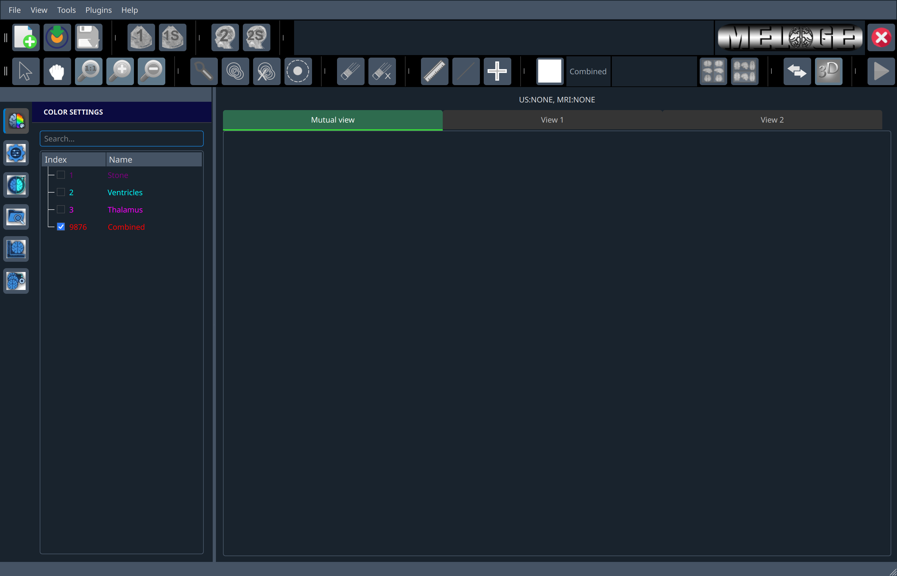

The main window is organised as follows (top to bottom):

```
┌──────────────────────────────────────────────────────────────┐
│  Menu Bar:  File  View  Tools  Plugins  Help                 │
├──────────────────────────────────────────────────────────────┤
│  Main Toolbar  (project + image loading)                     │
├──────────────────────────────────────────────────────────────┤
│  Interaction Toolbar  (drawing, zoom, navigation)            │
├────────────────────────────┬─────────────────────────────────┤
│  Central area              │  Dock Widgets (collapsible)     │
│  Tabs:                     │  • Color                        │
│    • Mutual view           │  • Image Enhancement            │
│    • View 1                │  • Measurements table           │
│    • View 2                │  • Images list                  │
│                            │  • Segmentation Intensity       │
│                            │  • Marker Size                  │
└────────────────────────────┴─────────────────────────────────┘
```

---

## 4. Projects — New, Save, Load

MELAGE uses a **project** system to save and restore your complete session: loaded images, segmentations, window geometry, and measurements.

### New Project

**File → New project** or  in the toolbar.

Creates a named project. All saves are written to this path until you use *Save As*.

### Save

**File → Save** or . Writes two files:

- **`<name>.bn`** — binary pickle with all image data, masks, measurements, and settings
- **`<name>.ini`** — window geometry and toolbar/dock layout

### Save As

**File → Save As** — saves to a new name/location.

### Load Project

**File → Load project** or . Restores a full `.bn` session.

### Close on Exit

When you close the application, MELAGE prompts you to save any unsaved changes.


> *From left to right: Create new project · Load project · Save*

---

## 5. Loading Images

### Image Toolbar

After creating a project, the image toolbar becomes active.

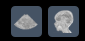

| Icon | Button | Description |
|------|--------|-------------|
| 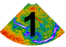 | **Open View 1** | Load an image into View 1 (default: ultrasound / ECO) |
|  | **Open View 2** | Load an image into View 2 (default: MRI) |
| 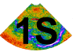 | **Import Seg View 1** | Import a segmentation mask for View 1 |
|  | **Import Seg View 2** | Import a segmentation mask for View 2 |

These are also accessible via **File → Import**.

The file browser shows a preview before opening. Use the **Type** dropdown to select the image type (Neonatal / MRI / etc.).

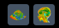

### Additional Imports

- **DTI / FA map:** File → Import → OpenFA
- **Tractography:** File → Import → OpenTract (`.trk` files, linked to View 2)

---

## 6. Toolbars

### Main Toolbar


| Icon | Button | Description |
|------|--------|-------------|
|  | New project | Create a new project |
|  | Load project | Load a saved `.bn` project |
|  | Save | Save current project |
|  | Open View 1 | Load image into View 1 |
|  | Import Seg View 1 | Import segmentation for View 1 |
|  | Open View 2 | Load image into View 2 |
|  | Import Seg View 2 | Import segmentation for View 2 |
|  | Exit | Exit the application |

> Image open buttons are disabled until a project is created.

---

### Interaction Toolbar


#### Navigation

| Icon | Button | Description |
|------|--------|-------------|
|  | Arrow | Default pointer / select mode |
|  | Pan | Click-drag to pan the view |
|  | Zoom Neutral | Reset zoom to fit window |
|  | Zoom In | Zoom in |
|  | Zoom Out | Zoom out |

#### Drawing / Segmentation

| Icon | Button | Description |
|------|--------|-------------|
|  | Paint | Freehand brush to paint segmentation |
|  | Contour | Draw closed contour; interior is filled |
|  | Contour X | Apply same contour to the next N slices |
|  | Circle | Draw circular ROI |
|  | Erase | Erase painted segmentation |
| 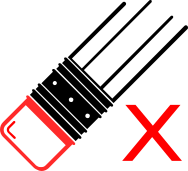 | Erase X | Erase on the next N slices |

#### Measurement & Annotation

| Icon | Button | Description |
|------|--------|-------------|
| 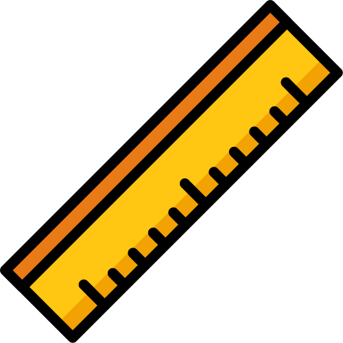 | Ruler | Measure distance between two points |
|  | Draw Line | Draw a straight annotation line |
|  | Point Selection | Place landmark points |
|  | Color | Change the active segmentation colour |

#### View Controls

| Icon | Button | Description |
|------|--------|-------------|
| 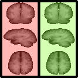 | Vertical View | Switch to coronal layout |
| 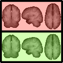 | Horizontal View | Switch to axial layout |
|  | Link | Link / unlink View 1 and View 2 navigation |
| 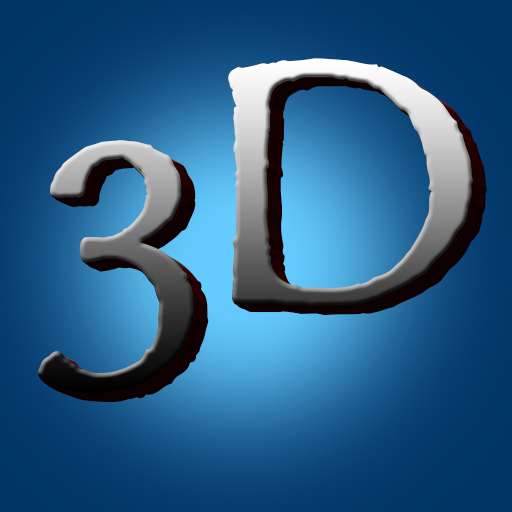 | 3D | Open 3D rendering window |
|  | Play | Play / pause video (chunked data) |

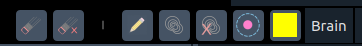

---

## 7. Viewing and Navigating Images

### Slice Navigation

Use the **horizontal slider** beneath each panel to scroll through slices. The slice number is shown above each plane.

Plane labels shown in the view corners:
- **S** — Sagittal
- **A** — Axial
- **C** — Coronal

### View Orientation

Use **Vertical View**  / **Horizontal View**  to switch between coronal and axial primary layout.

### Linked Views

In the **Mutual view** tab, activate  **Link** to synchronise slice navigation between View 1 and View 2. Scrolling in one panel updates the other to the matching anatomical position.

### Guide Lines and Axis Lines

**View → Guides** — toggles crosshair overlay lines.  
**View → Axis** — toggles anatomical axis markers.

### Zoom

- **Scroll wheel** — zoom in/out on the active panel
-  /  toolbar buttons affect all panels simultaneously
-  **Zoom Neutral** resets all panels to fit-to-window

### Video Playback

For chunked video data (ultrasound, MP4), the  **Play** button animates the slices as a video.

---

## 8. Annotation and Segmentation Drawing

### Painting

1. Click  **Paint**.
2. Select a colour using  **Color** or the **Color Widget** in the dock.
3. Left-click and drag over a slice to paint the segmentation mask.
4. Use  **Erase** to remove painted regions.

### Contour Drawing

1. Click  **Contour**.
2. Click to place vertices around the region.
3. Double-click to close and fill the contour.

 **Contour X times** — repeats the same contour on the next N slices automatically.

### Circle Segmentation

Click  **Circle** and drag to draw a circular ROI. Adjust the radius using the **Marker Size** dock widget.

### Slice Interpolation

After segmenting two non-adjacent slices:
1. Right-click the segmented region → **Add to interpolation**
2. Navigate to another slice, segment it → right-click → **Add to interpolation**
3. Right-click → **Apply interpolation** to fill the in-between slices

### Measurements

Click  **Ruler**, then:
1. Left-click to place the first point
2. Left-click to place the second point — distance (mm) is computed from the image header spacing

Right-click an existing ruler: **Center position · Length · Line angle · Remove · Send to table**

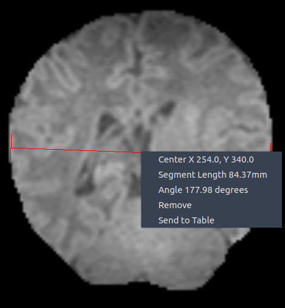

### Undo / Redo

**Tools → Undo** — reverts the last segmentation action (up to 10 steps)  
**Tools → Redo** — reapplies an undone action (up to 10 steps)

---

## 9. Dock Widgets

### Color Widget

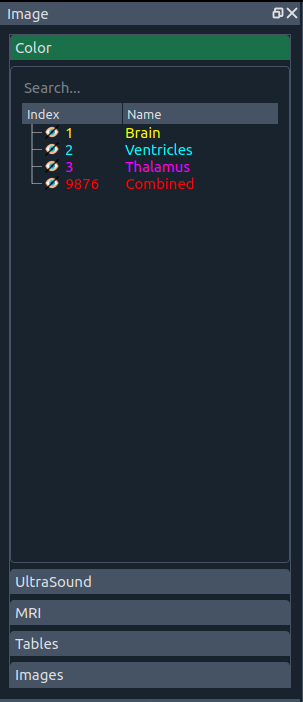

Displays the lookup table (LUT) of available segmentation colours. Supported atlases:
- Albert
- Neonatal Brain Atlas
- M-CRIB 2.0 Neonatal Brain Atlas
- Adult Brain Atlas
- Two tissue segmentation schemes

Right-click to switch LUT style, add a custom style, or import a new colour scheme.

**Adding a new colour:** Click the colour swatch in the segmentation toolbar → enter an index and name.

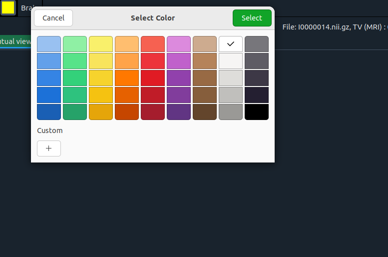

### Image Enhancement Widget

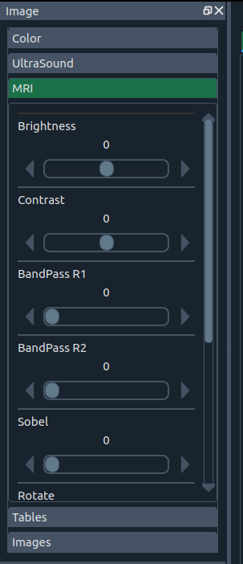

Controls for brightness, contrast, and filters:
- Brightness / Contrast sliders
- Bandpass filter
- Hamming filter
- Sobel operator (edge detection)
- Rotation by sagittal / axial / coronal angle
- **Sagittal↔Coronal swap** for ultrasound images

### Measurements Table

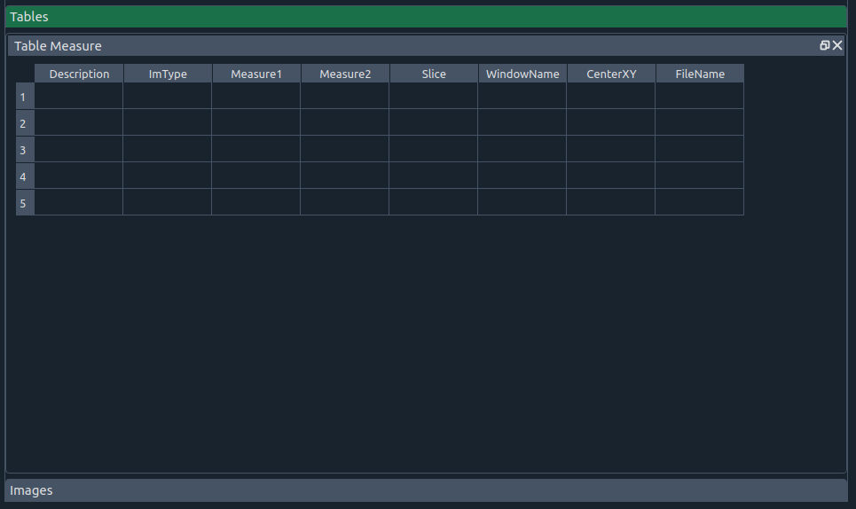

Stores measurements from the Ruler and Contour tools. Columns:

| Column | Description |
|--------|-------------|
| Description | Free-text note |
| Image type | MRI (bottom) or Ultrasound (top) |
| Measure 1 | Surface area or Length |
| Measure 2 | Perimeter or Angle |
| Slice | Slice number |
| Window name | Sagittal / Coronal / Axial |
| CenterXY | Centre position |
| FileName | Source filename |

Right-click in the table: **Add · Edit · Export (CSV) · Remove**

### Images Widget

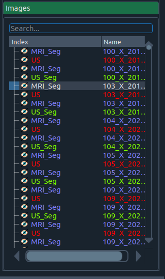

A list of all imported images and segmentations. Click the visibility icon to toggle display. A segmentation file cannot be loaded before its corresponding image.

Right-click: **Import Images / Segmentation · Remove Selected · Clear All**

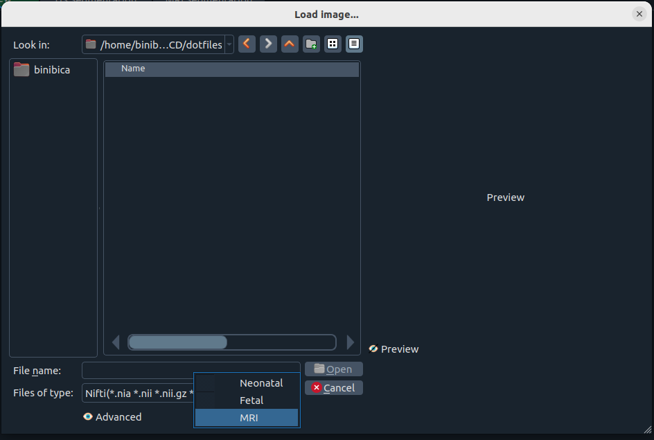

### Segmentation Intensity Widget

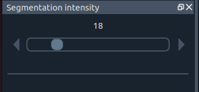

Controls the opacity of the segmentation overlay. Set to **0** to hide all segmentations.

### Marker Size Widget

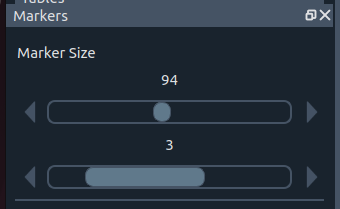

Two sliders (top to bottom):
1. **Circle radius** — for the Circle segmentation tool
2. **Pen thickness** — for the Contour / Paint tool

---

## 10. Tabs

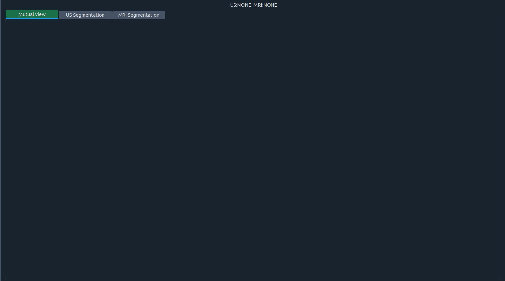

### Mutual View

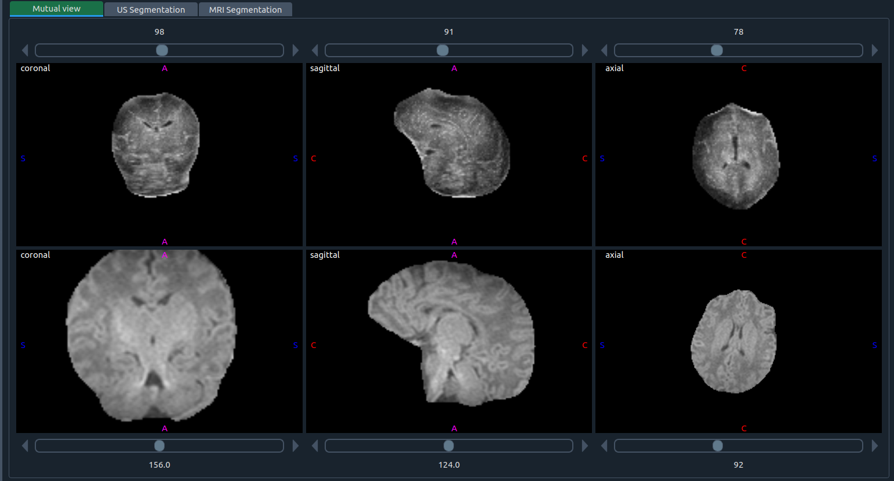

Shows View 1 and View 2 side by side, each with three planes (coronal, sagittal, axial). The **top row** is for ultrasound / View 1; the **bottom row** is for MRI / View 2. When one image is closed, the tab shows only three planes for the remaining image.

Use  **Link** to synchronise navigation across both views.

### View 1 Tab

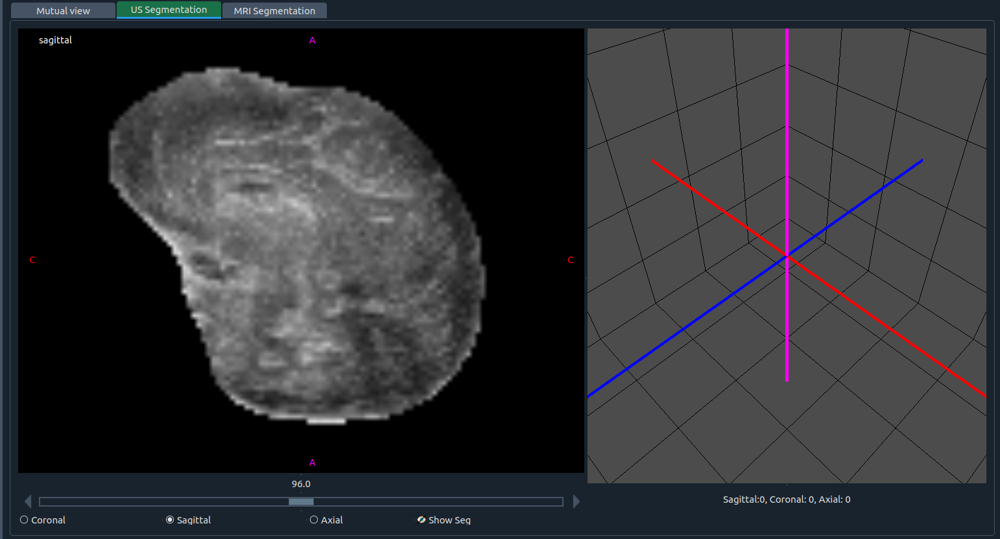

Full panel view for View 1. Components:
- Large plane display for concentrated work
- **Horizontal slider** to scroll slices
- **Plane selector** radio buttons (Sagittal / Axial / Coronal)
- **Show Seg** radio button to toggle segmentation visibility
- **3D visualisation** panel (bottom right)

### View 2 Tab

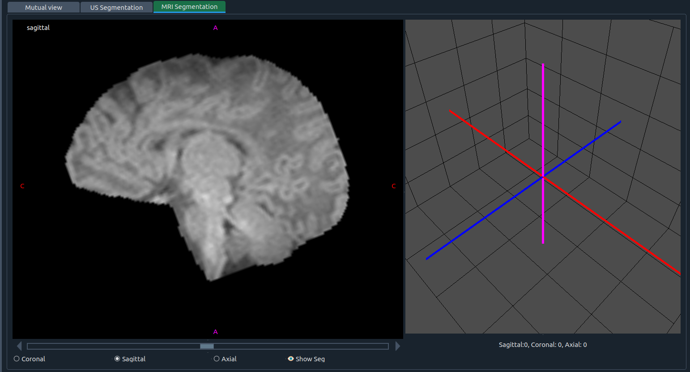

Same layout as View 1, dedicated to View 2 (MRI or second image).

---

## 11. 3D Visualisation

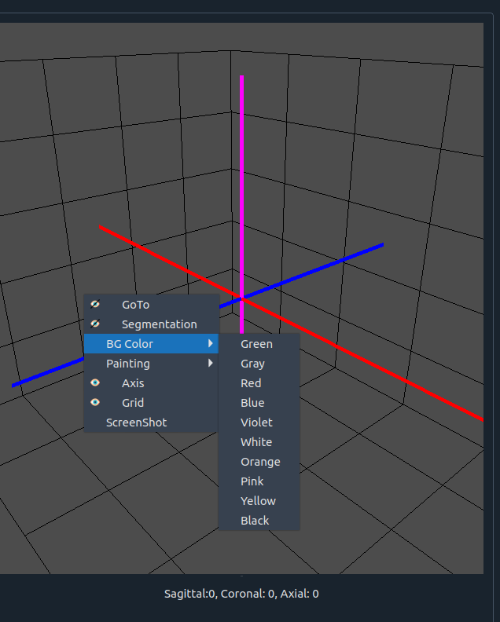

Click  **3D** to toggle the 3D rendering panel. Right-click inside it to access:

| Option | Description |
|--------|-------------|
| GoTo | Navigate the 2D planes to the clicked 3D location |
| Segmentation | Toggle segmentation overlay in 3D |
| BG color | Change the 3D background colour |
| Painting → Draw | Draw a cut plane on the 3D surface |
| Painting → Show total | Restore the full uncut 3D view |
| Image render | Render with a colour map: Rainbow / Gray / Jet / Gnuplot / Gnuplot2 / Original |
| Axis | Show anatomical axis overlay |
| Grid | Show 3D grid overlay |

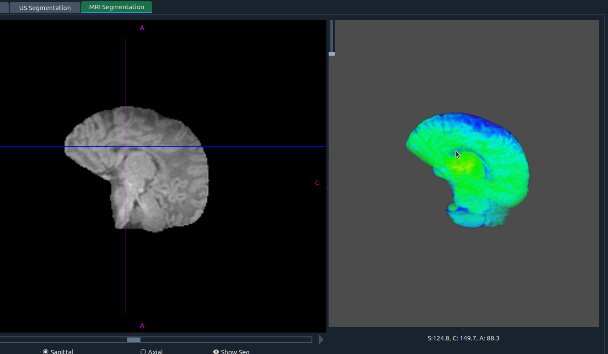

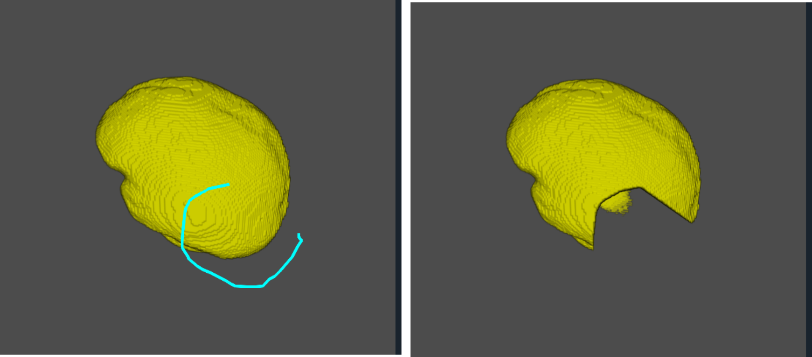

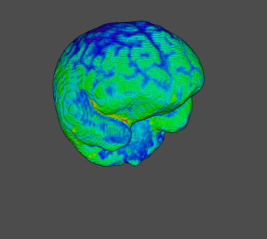

> **Tip:** If the segmentation does not appear in 3D, switch to another tab and come back to refresh it.

---

## 12. Tools Menu

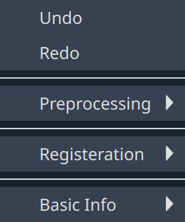

### Undo / Redo

**Tools → Undo** / **Redo** — step through annotation history (up to 10 steps each).

---

### Preprocessing

#### Image Masking

**Tools → Preprocessing → Image Masking**

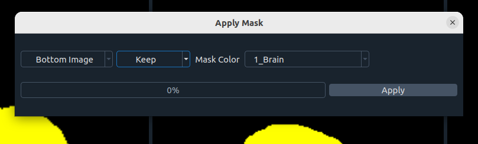

Zeroes out image regions outside (or inside) a selected segmentation mask.

| Control | Description |
|---------|-------------|
| Image selector | View 1 (top) or View 2 (bottom) |
| Keep / Remove | Whether to keep or remove the masked region |
| Mask Color | The segmentation colour used as the mask |

> To restore the original image: set Mask Color to `9876_Combined`.

#### Masking Operation

**Tools → Preprocessing → Masking Operation**

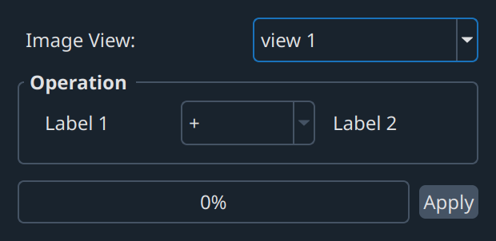

Boolean operations between two mask colours.

| Control | Description |
|---------|-------------|
| Masking Color (result) | Colour index where the result is written |
| Operation | Sum (union) or Subtract (difference) |
| Masking Color (operand) | Second mask to combine |
| Image selector | View 1 or View 2 |

#### Image Thresholding

**Tools → Preprocessing → Image Thresholding**

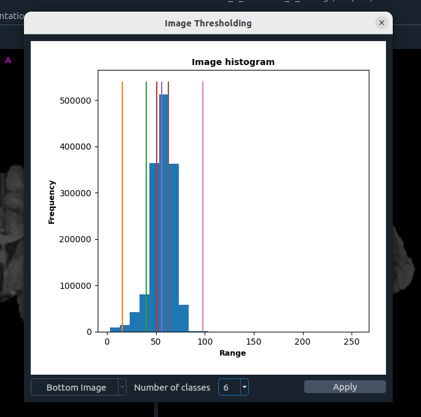

Multi-Otsu thresholding to produce a binary or multi-class mask from intensity.

| Control | Description |
|---------|-------------|
| Image selector | View 1 or View 2 |
| Number of classes | How many Otsu levels to compute |

---

### Registration

#### Image Registration

**Tools → Registration → Image Registration**

Registers View 1 to View 2 (or vice versa), producing a resampled image in the target space.

#### Image Transformation

**Tools → Registration → Image Transformation**

Applies a pre-computed transformation matrix to an image.

---

### Basic Info

#### Image Histogram

**Tools → Basic Info → Image Histogram**

Interactive histogram of voxel intensities for the selected view.

#### Images Info.

**Tools → Basic Info → Images Info.**

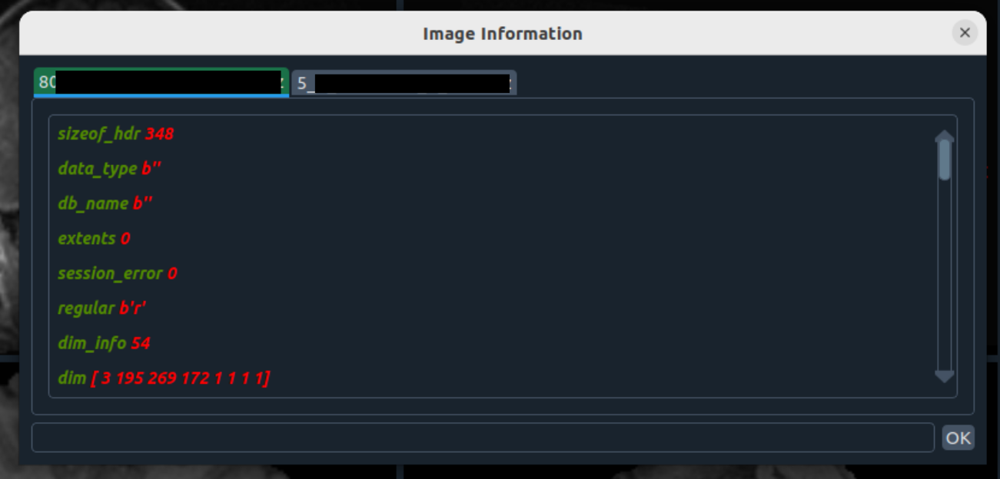

Displays all NIfTI header fields: dimensions, voxel spacing, orientation codes, data type, and the full affine matrix. A search bar allows filtering fields.

---

### Calc → Total Volume

**Calc → Total Volume → Coronal / Sagittal / Axial**

Computes the total labelled volume (voxel count × voxel volume in mm³) for the current segmentation.

---

## 13. Plugins

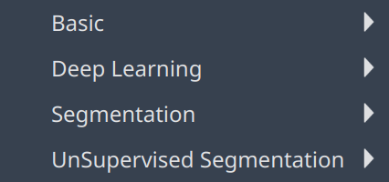

Plugins are found in the **Plugins** menu, organised by category. Each plugin opens a dialog, runs the algorithm, and writes the result back to the selected view automatically.

> **Every plugin dialog** has an **"Image View:"** dropdown at the top — choose *view 1* or *view 2* to select which loaded image to process.

---

### Category: Basic

#### Resize

**Plugins → Basic → Resize**

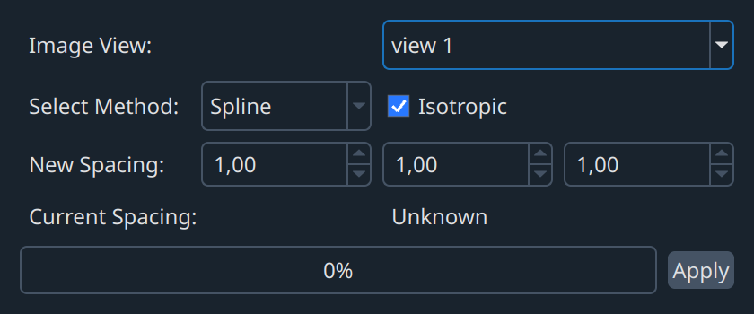

Resamples the image to a new voxel spacing.

| Control | Description |
|---------|-------------|
| Select Method | `Spline` (high quality) or `Linear` (faster) |
| Isotropic | Lock X/Y/Z spacing together |
| New Spacing X / Y / Z | Target voxel spacing in mm |
| Current Spacing | Read-only display of the current spacing |

---

#### N4 Bias Correction

**Plugins → Basic → N4 Bias**

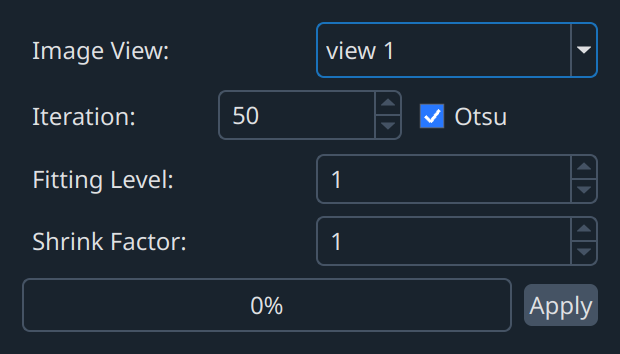

Corrects low-frequency MRI intensity inhomogeneity using the N4ITK algorithm.

| Control | Description |
|---------|-------------|
| Iterations | Number of fitting iterations |
| Fitting Levels | Number of multi-resolution levels |
| Shrink Factor | Sub-sampling factor (higher = faster) |
| Use Otsu Mask | Restrict correction to tissue regions |

---

#### Change Coordinate System

**Plugins → Basic → Change Coord Sys.**

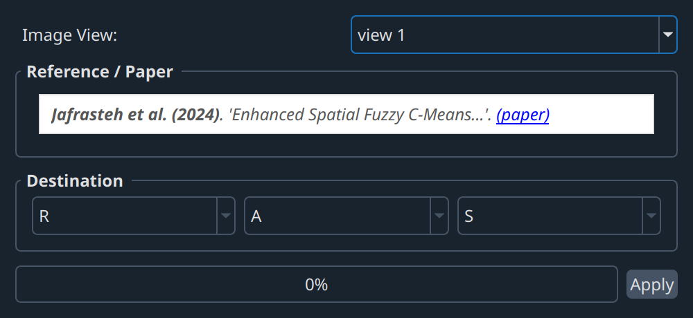

Reorients the image to a target anatomical coordinate system (e.g., RAS, LPI, IPL).

| Combo | Description |
|-------|-------------|
| 1st axis | Direction for the first axis (R/L/A/P/S/I) |
| 2nd axis | Auto-filtered to exclude the 1st axis |
| 3rd axis | Auto-filtered to exclude the 1st and 2nd axes |

Invalid combinations (e.g., R and L on the same axis) are prevented automatically.

---

### Category: UnSupervised Segmentation

#### BET — Brain Extraction Tool

**Plugins → UnSupervised Segmentation → BET**

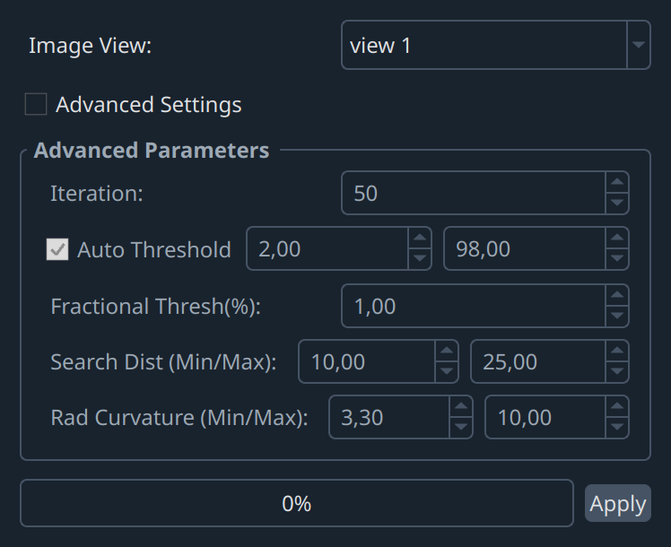

Extracts the brain from skull and non-brain tissue, producing a binary brain mask.

> Reference: Smith SM. *Fast robust automated brain extraction.* Hum Brain Mapp. 2002;17(3):143–55.

| Control | Description |
|---------|-------------|
| Advanced Settings | Enables the parameters below |
| Iterations | Number of surface evolution iterations |
| Auto Threshold | Use multi-Otsu for intensity bounds |
| Hist Thresh Min / Max | Percentile bounds (when Auto is off) |
| Fractional Threshold (%) | Controls tightness of the brain boundary |
| Search Distance Min / Max | Surface search distance range (mm) |
| Radius of Curvature Min / Max | Surface curvature constraints |

---

#### FCM — Fuzzy C-Means Tissue Segmentation

**Plugins → UnSupervised Segmentation → FCM**

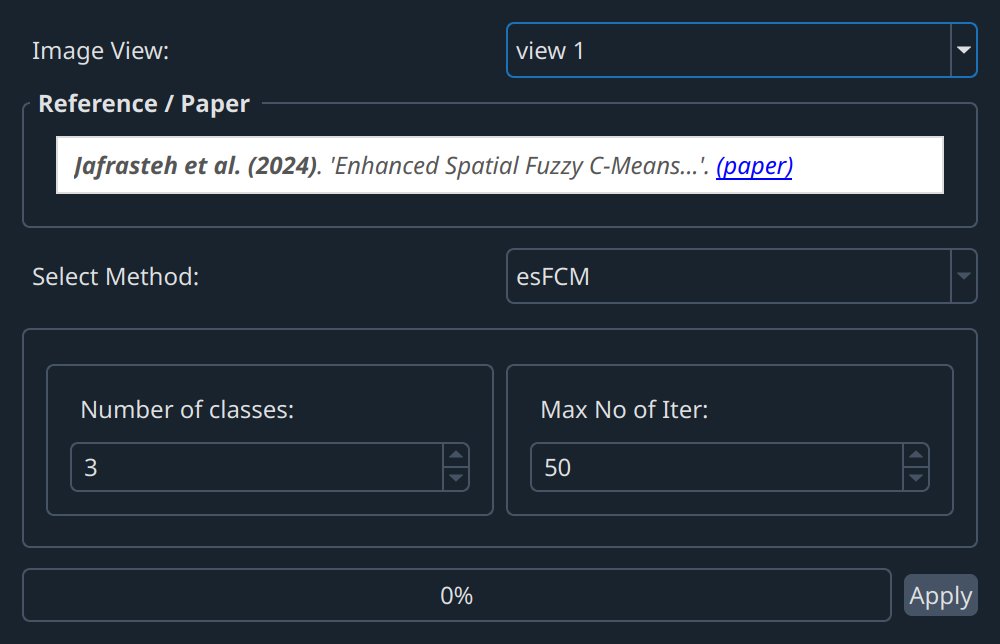

Segments brain tissue into N classes using an entropy-regularised Fuzzy C-Means algorithm.

| Control | Description |
|---------|-------------|
| Select Method | Algorithm variant |
| Number of Classes | Tissue classes (e.g. 3 = WM / GM / CSF) |
| Max Iterations | Maximum number of FCM iterations |

---

### Category: Segmentation

#### WarpSeg (Dynamic)

**Plugins → Segmentation → WarpSeg (Dynamic)**

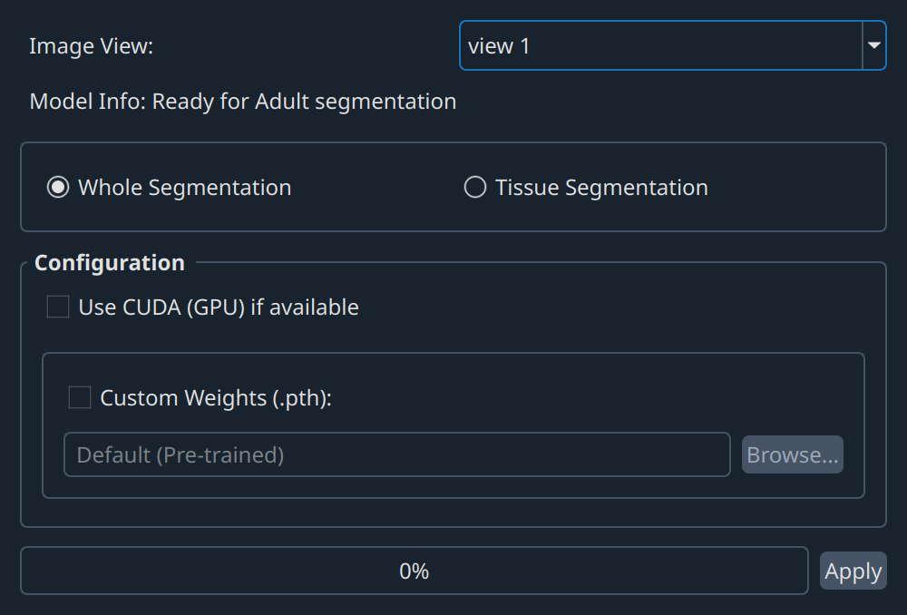

Deep learning brain segmentation using a VoxelMorph registration–segmentation network.

| Control | Description |
|---------|-------------|
| Whole Segmentation | Full multi-label brain parcellation |
| Tissue Segmentation | Tissue-only labels (WM / GM / CSF) |
| Use CUDA | Use GPU if available (significantly faster) |
| Custom Weights | Browse to a custom `.pth` weights file |

Default weights are loaded from **Settings → Default Models Directory**.

> Not supported for video / chunked ultrasound input.

---

### Category: Deep Learning

#### MGA-Net

**Plugins → Deep Learning → MGA-Net**

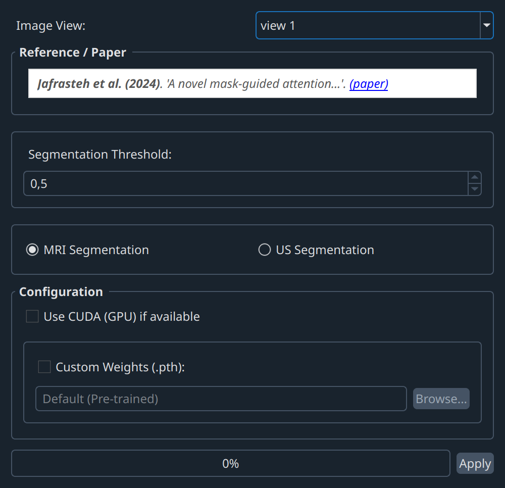

Mask-Guided Attention network for infant/adult brain segmentation from MRI or ultrasound.

> Reference: Jafrasteh et al. (2024). *A novel mask-guided attention network...* NeuroImage. [paper](https://www.sciencedirect.com/science/article/pii/S1053811924003690)

| Control | Description |
|---------|-------------|
| Segmentation Threshold | Decision threshold (default 0.5; lower = more inclusive) |
| MRI Segmentation | Input is MRI |
| US Segmentation | Input is ultrasound |
| Use CUDA | Use GPU if available |
| Custom Weights | Browse to a custom `.pth` weights file |

> Not supported for video / chunked input.

---

#### SAM 2 (Video/3D)

**Plugins → Deep Learning → SAM 2 (Video/3D)**

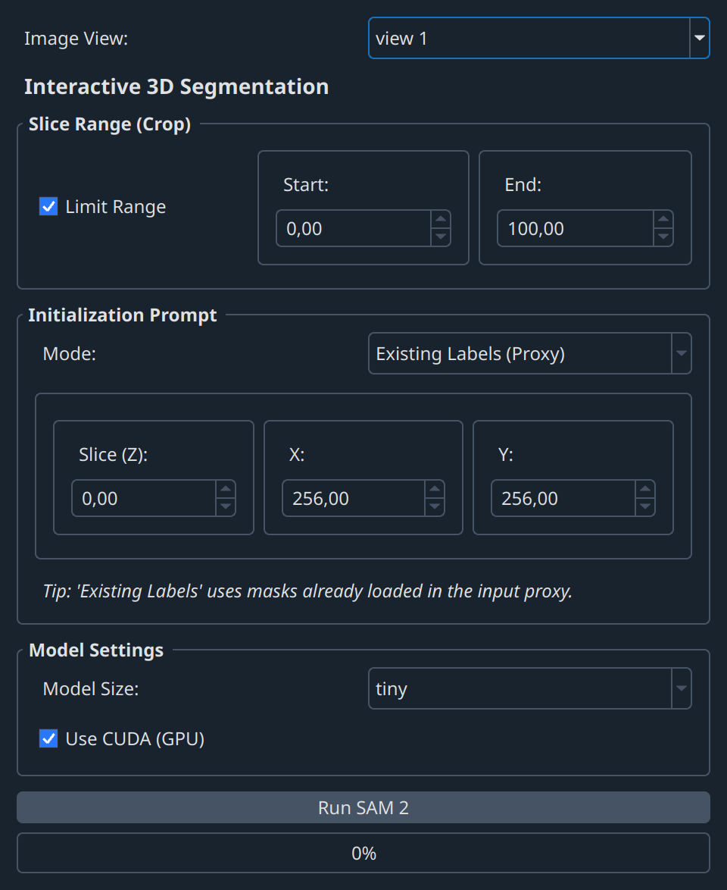

Applies Meta's Segment Anything Model 2.1 to propagate a segmentation across frames of a video volume (3D ultrasound, cine MRI, etc.).

**Workflow:**
1. Navigate to a representative slice and draw a seed mask using  **Paint**.
2. Open the SAM 2 plugin.
3. Choose the view, model size, and optionally enable **Limit Range**.
4. Click **Apply** — SAM 2 exports frames to a temp folder, loads the model, uses your drawn mask as the seed prompt, and propagates bidirectionally.

| Control | Description |
|---------|-------------|
| Model Size | `tiny` / `small` / `base_plus` / `large` — larger = more accurate, slower |
| Mode | Prompt-based (uses existing labels) |
| Use CUDA | Use GPU (strongly recommended) |
| Limit Range | Restrict propagation to a Start → End frame range |
| Start / End | Frame range (auto-constrained so Start < End) |

**Requirements:**
- The `sam2` package must be installed
- Checkpoint files must be present in `melage/plugins/sam/checkpoints/`
- A seed mask must be drawn on the current slice before clicking Apply

> Only supported for chunked video / 3D ultrasound. MRI/CT support is planned.

---

## 14. Exporting Results

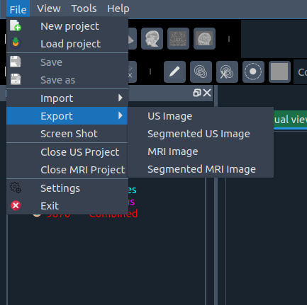

**File → Export** provides four options:

| Export | What is saved |
|--------|--------------|
| Image View 1 | Current image for View 1 as NIfTI |
| Segmented View 1 | Current segmentation mask for View 1 as NIfTI |
| Image View 2 | Current image for View 2 as NIfTI |
| Segmented View 2 | Current segmentation mask for View 2 as NIfTI |

Exported files receive a suffix appended to the original filename. An accompanying `.json` metadata file is also written alongside the output.

---

## 15. Settings

**File → Settings**

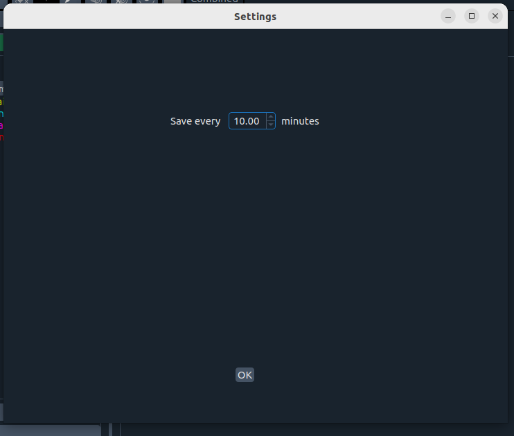

Settings are stored in `~/.melage_settings.json` and persist between sessions.

| Setting | Default | Description |
|---------|---------|-------------|
| Default Models Directory | `<install>/models/NetworkWeights` | Path where `.pth` model weights are stored |
| Default Working Directory | `~/Desktop` | Default folder for file open / save dialogs |
| Auto Save Interval | 10 min | Interval for automatic project saving |

---

## 16. Headless (Command-Line) Mode

MELAGE can run without a GUI for scripting or batch processing.

### Syntax

```bash
melage --headless --tool <tool_id> --input <input_file> --output <output_file>
```

### Available Headless Tools

| Tool ID | Description |
|---------|-------------|
| `bet` | Brain Extraction Tool |
| `mga_net` | MGA-Net deep learning segmentation |

### Examples

```bash
# Brain extraction
melage --headless --tool bet \
    --input /data/subject_T1.nii.gz \
    --output /data/subject_brain_mask.nii.gz

# MGA-Net segmentation
melage --headless --tool mga_net \
    --input /data/subject_T1.nii.gz \
    --output /data/subject_seg.nii.gz
```

> Both `--input` and `--output` are required. The output is saved as NIfTI preserving the input affine and header.

---

## 17. Mouse and Interaction Reference

| Action | Mode | Effect |
|--------|------|--------|
| Left-click + drag | Pan | Pan the view |
| Left-click + drag | Paint | Paint segmentation |
| Left-click + drag | Erase | Erase segmentation |
| Left-click (repeat) | Contour | Add contour vertex |
| Double-click | Contour | Close and fill contour |
| Left-click | Ruler (1st) | Set first measurement point |
| Left-click | Ruler (2nd) | Set second point, compute distance |
| Scroll wheel | Any | Navigate slices |
| Right-click | Contour tool | Center / Surface / Perimeter / Send to table / Interpolation |
| Right-click | Ruler tool | Center / Length / Angle / Remove / Send to table |
| Right-click | 3D panel | GoTo / Segmentation / BG color / Painting / Render / Axis / Grid |
| Right-click | Image list | Import / Remove / Clear All |
| Right-click | Table widget | Add / Edit / Export CSV / Remove |

---

## Appendix A — Project File Format

| File | Contents |
|------|----------|
| `<name>.bn` | Binary pickle: image geometry, segmentation masks, measurement table, version info, settings snapshot |
| `<name>.ini` | Qt INI: window geometry, toolbar positions, dock layout |

Both files are needed to fully restore a session. The `.bn` file alone is sufficient to recover image and segmentation data programmatically.

---

## Appendix B — Adding a New Plugin

Each plugin requires two files in `melage/plugins/<plugin_name>/`:

**1. `<plugin_name>.py`**

```python
from melage.widgets import MelagePlugin
from melage.dialogs.dynamic_gui import DynamicDialog
from PyQt5.QtCore import pyqtSignal

class MyLogic(DynamicDialog):
    completed = pyqtSignal(object)

    def __init__(self, data_context, parent=None):
        super().__init__(parent)
        self.create_main_ui(schema=get_schema(), default_items=False)
        self.data_context = data_context

    def on_btn_apply_clicked(self):
        # ... run algorithm ...
        self.completed.emit({
            "image": result_array,   # None if only updating the mask
            "affine": affine_matrix, # None to preserve existing
            "label": mask_array,     # None to reset segmentation
            "view": "view 1"
        })

class MyPlugin(MelagePlugin):
    @property
    def name(self): return "My Plugin"
    @property
    def category(self): return "Basic"
    def get_widget(self, data_context=None, parent=None):
        return MyLogic(data_context, parent)
```

**2. `<plugin_name>_schema.py`**

```python
from melage.plugins.ui_helpers import HBox, Label, SpinBox, Button, Progress

def get_schema():
    return {
        "title": "My Plugin",
        "min_width": 350,
        "layout": "vbox",
        "items": [
            HBox([Label("Value:"), SpinBox(id="spin_val", value=1.0)]),
            HBox([Progress(id="progress_bar"), Button(id="btn_apply", text="Apply")])
        ]
    }
```

The plugin is **auto-discovered** at startup — no registration needed. It appears under **Plugins → \<category\>**.

---

*MELAGE v2.1.1 — Dec 30 2025*
